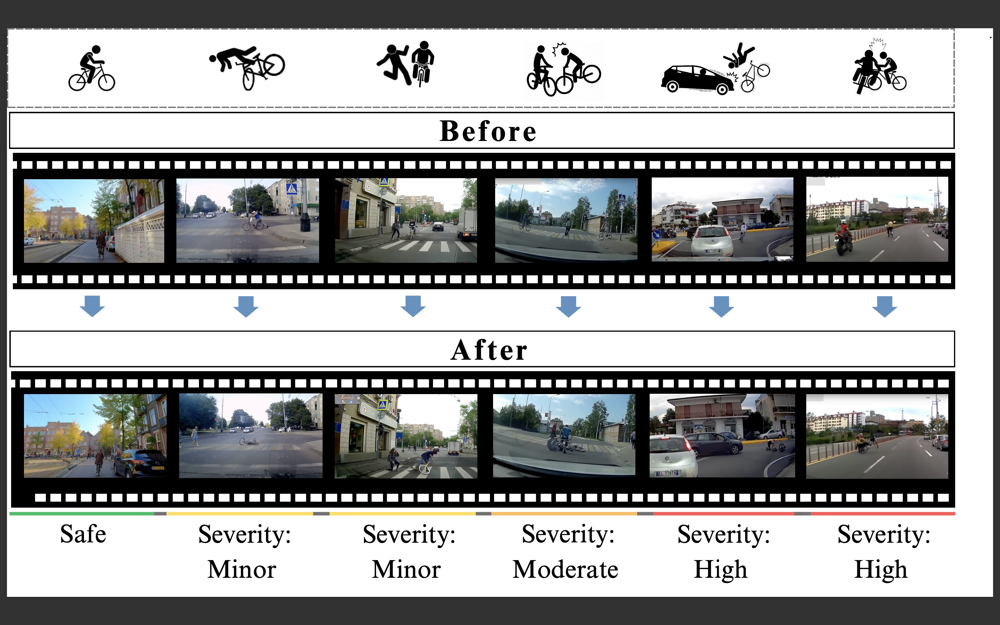

<h1 align="center">CycleCrash: A Dataset of Bicycle Collision Videos for Collision Prediction and Analysis</h1>

<h3 align="center">
This paper has been accepted to WACV 2025
</h3>

<h3 align="center">
<a href="https://scholar.google.com/citations?user=m2uTpYIAAAAJ&hl=en">Nishq Poorav Desai</a>
&nbsp; <a href="https://scholar.google.ca/citations?user=UvOC8MkAAAAJ&hl=en">Ali Etemad</a>
&nbsp; <a href="https://scholar.google.ca/citations?user=x-M8l7IAAAAJ&hl=en">Michael Greenspan</a>
</h3>

<h3 align="center"> 
<a href="#">[Paper]</a>  
<a href="#"> [Appendix]</a> 
<a href="#"> [ArXiv]</a> 
<a href="https://github.com/DeSinister/CycleCrash/"> [Website]</a>
</h3>


<p align="center"></p>

## Overview
This repo contains the CycleCrash dataset and the code for our <a href="#">[WACV2025 paper]</a> on bicycle collision prediction and analysis. 

The dataset consists of 3,000 dashcam videos with 436,347 frames that capture cyclists in a range of critical situations, from collisions to safe interactions. This dataset enables 9 different cyclist collision prediction and classification tasks focusing on potentially hazardous conditions for cyclists and is annotated with collision-related, cyclist-related, and scene-related labels. Please refer to the `dataset.csv` file for detailed annotations and additional information about each video in the dataset.

This code also contains PyTorch implementation for VidNeXt, a novel method that uses a non-stationary transformer on the defined tasks within our dataset, along with 7 baseline models. 


## Files
- **<a href="https://github.com/DeSinister/CycleCrash/blob/main/dataset.csv">dataset.csv</a>**: CSV file containing the CycleCrash dataset.
- **<a href="https://github.com/DeSinister/CycleCrash/blob/main/download/download_dataset.py">download_dataset.py</a>**: Python script to download the videos of the dataset.
- **<a href="https://github.com/DeSinister/CycleCrash/blob/main/download/preprocess.py">preprocess.py</a>**: Python script to Pre-process videos for background cropping and uniform temporal and spatial dimensions.
- **<a href="https://github.com/DeSinister/CycleCrash/blob/main/src/data_loader.py">data_loader.py</a>**: Python script for implementing PyTorch-based Data loader for CycleCrash dataset
- **<a href="https://github.com/DeSinister/CycleCrash/blob/main/src/get_model.py">get_model.py</a>**: Python script to load the baseline models, the proposed VidNeXt and its ablation variants.

## Preparing the dataset


1. **Clone the Github repository**:
   - Run the following command in a terminal to clone the GitHub repository in your current location.
   ```
   git clone https://github.com/DeSinister/CycleCrash.git
   cd CycleCrash
   ```
     
2. **Installing Packages**
   - Run the following command to make sure the necessary packages are installed.
   ```    
   pip install -r requirements.txt
   ```
   
3. **FFmpeg**:
   - Download the full build of FFmpeg from [FFmpeg Releases](https://ffmpeg.org/download.html).
   - Extract the downloaded ZIP file to a location on your system, e.g., `C:\ffmpeg-6.0-full_build`.

4. **yt-dlp**:
   - Download `yt-dlp` from the [yt-dlp GitHub repository](https://github.com/yt-dlp/yt-dlp#installation).
   - Place the `yt-dlp.exe` in the `bin` directory of the FFmpeg folder, e.g., `C:\ffmpeg-6.0-full_build\ffmpeg-6.0-full_build\bin`.

5. **Downloading the dataset**
   - Set the paths for the dataset.csv, output folder, and folder path containing yt-dlp.exe in download_dataset.py.
   - Run the python file download.py to collect the videos.
   ```    
   python download/download_dataset.py
   ```

6. **Preprocessing the videos**
   - Set the paths for the dataset.csv, the directory where videos are stored, and the output directory in pre_process.py
   - Run the preprocess.py file.
   ```    
   python download/preprocess.py
   ```


## Training VidNeXt
- Run src/main.py with the required hyperparameter setting in arguments.
```    
python src/main.py -vid_dir PATH_TO_PREPROCESSED_VIDEOS -csv_file PATH_TO_DATASET_CSV -task TASK_TYPE 
```


## Results

<table>
  <thead>
    <tr>
      <th rowspan="3">Method</th>
      <th colspan="2">Risk</th>
      <th colspan="2">Right-of-way</th>
      <th colspan="2">Collision</th>
      <th colspan="1">Time-to-coll.</th>
      <th colspan="2">Severity</th>
      <th colspan="2">Fault</th>
      <th colspan="2">Age</th>
      <th colspan="2">Direction</th>
      <th colspan="2">Object</th>
    </tr>
    <tr>
      <th>Acc. &uarr;</th>
      <th>F1 &uarr;</th>
      <th>Acc. &uarr;</th>
      <th>F1 &uarr;</th>
      <th>Acc. &uarr;</th>
      <th>F1 &uarr;</th>
      <th>MSE &darr;</th>
      <th>Acc. &uarr;</th>
      <th>F1 &uarr;</th>
      <th>Acc. &uarr;</th>
      <th>F1 &uarr;</th>
      <th>Acc. &uarr;</th>
      <th>F1 &uarr;</th>
      <th>Acc. &uarr;</th>
      <th>F1 &uarr;</th>
      <th>Acc. &uarr;</th>
      <th>F1 &uarr;</th>
    </tr>
  </thead>
  <tbody>
    <tr>
      <td>TimeSformer</td>
      <td>65.74</td>
      <td><i>41.79</i></td>
      <td>60.20</td>
      <td>55.71</td>
      <td><i>66.45</i></td>
      <td>69.69</td>
      <td>1.41</td>
      <td>36.49</td>
      <td>23.01</td>
      <td>59.65</td>
      <td>51.03</td>
      <td>93.77</td>
      <td>66.68</td>
      <td>47.19</td>
      <td><i>31.38</i></td>
      <td><i>45.02</i></td>
      <td><b>29.00</b></td>
    </tr>
    <tr>
      <td>ViViT</td>
      <td>65.12</td>
      <td>39.06</td>
      <td>52.84</td>
      <td>53.74</td>
      <td>57.01</td>
      <td><i>69.92</i></td>
      <td><b>1.33</b></td>
      <td>47.51</td>
      <td>24.47</td>
      <td>53.37</td>
      <td>50.42</td>
      <td>93.56</td>
      <td>66.34</td>
      <td>36.29</td>
      <td>27.99</td>
      <td><b>46.30</b></td>
      <td>26.34</td>
    </tr>
    <tr>
      <td>ResNet50 3D</td>
      <td>65.76</td>
      <td>39.53</td>
      <td>59.41</td>
      <td>53.97</td>
      <td>63.10</td>
      <td>60.24</td>
      <td><i>1.38</i></td>
      <td>56.60</td>
      <td>26.12</td>
      <td>59.37</td>
      <td><i>54.91</i></td>
      <td>94.21</td>
      <td>54.86</td>
      <td>46.30</td>
      <td>30.12</td>
      <td>43.27</td>
      <td>27.77</td>
    </tr>
    <tr>
      <td>R(2+1)D</td>
      <td><i>66.54</i></td>
      <td>39.56</td>
      <td>60.31</td>
      <td>53.42</td>
      <td><b>67.71</b></td>
      <td>63.33</td>
      <td>1.43</td>
      <td><i>56.63</i></td>
      <td>25.46</td>
      <td>50.53</td>
      <td>52.62</td>
      <td>94.41</td>
      <td>53.24</td>
      <td>47.49</td>
      <td>30.36</td>
      <td>40.75</td>
      <td>25.48</td>
    </tr>
    <tr>
      <td>X3D-M</td>
      <td>64.76</td>
      <td>38.75</td>
      <td>59.83</td>
      <td><i>57.57</i></td>
      <td>63.72</td>
      <td>61.08</td>
      <td>1.44</td>
      <td>54.45</td>
      <td>24.70</td>
      <td>52.16</td>
      <td>52.19</td>
      <td>94.34</td>
      <td>53.78</td>
      <td><i>47.82</i></td>
      <td>31.85</td>
      <td>42.72</td>
      <td>23.79</td>
    </tr>
    <tr>
      <td>X3D-S</td>
      <td>63.37</td>
      <td>36.28</td>
      <td>60.10</td>
      <td>56.90</td>
      <td>61.49</td>
      <td>61.13</td>
      <td>1.47</td>
      <td>51.80</td>
      <td>24.09</td>
      <td><i>60.47</i></td>
      <td>51.88</td>
      <td>94.38</td>
      <td>54.30</td>
      <td>45.62</td>
      <td>30.05</td>
      <td>42.03</td>
      <td>22.38</td>
    </tr>
    <tr>
      <td>X3D-XS</td>
      <td>64.77</td>
      <td>37.23</td>
      <td>59.37</td>
      <td>53.43</td>
      <td>60.59</td>
      <td>60.73</td>
      <td>1.47</td>
      <td>51.39</td>
      <td>23.77</td>
      <td>56.10</td>
      <td>52.59</td>
      <td>93.87</td>
      <td>52.37</td>
      <td>46.77</td>
      <td>30.22</td>
      <td>41.73</td>
      <td>26.57</td>
    </tr>
    <tr>
      <td><b>ConvNeXt+VT</b></td>
      <td>64.89</td>
      <td>40.05</td>
      <td>61.13</td>
      <td>54.00</td>
      <td>63.50</td>
      <td>65.06</td>
      <td>1.56</td>
      <td>53.80</td>
      <td><i>26.54</i></td>
      <td>56.74</td>
      <td><b>55.72</b></td>
      <td><i>94.55</i></td>
      <td><i>66.78</i></td>
      <td>46.46</td>
      <td><b>32.62</td>
      <td>42.85</td>
      <td>25.16</td>
    </tr>
    <tr>
      <td><b>ResNet+NST</b></td>
      <td><b>67.18</b></td>
      <td>40.74</td>
      <td><i>61.77</i></td>
      <td><b>58.62</b></td>
      <td>60.79</td>
      <td>62.28</td>
      <td>1.39</td>
      <td>53.88</td>
      <td>24.67</td>
      <td>57.17</td>
      <td>54.08</td>
      <td>94.52</td>
      <td>53.49</td>
      <td>45.12</td>
      <td>28.48</td>
      <td>44.17</td>
      <td>26.91</td>
    </tr>
    <tr>
      <td><b>VidNeXt (Ours)</b></td>
      <td>66.20</td>
      <td><b>41.96</b></td>
      <td><b>64.28</b></td>
      <td>57.51</td>
      <td>64.84</td>
      <td><b>70.84</b></td>
      <td><i>1.38</i></td>
      <td><b>59.66</b></td>
      <td><b>31.78</b></td>
      <td><b>65.16</b></td>
      <td>52.51</td>
      <td><b>94.57</b></td>
      <td><b>67.88</b></td>
      <td><b>47.94</b></td>
      <td>31.20</td>
      <td>42.31</td>
      <td><i>28.37</i></td>
    </tr>
  </tbody>
</table>


<p><i>Combined experimental results for tasks 1 through 9. The methods include the 7 baselines based on prior works, 2 <b>ablation</b> variants, and VidNeXt.</i></p>


### Citation
If you find this repository useful, please consider giving it a star :star: and citing the paper:
```
@inproceedings{desai2025cyclecrash,
  title={CycleCrash: A Dataset of Bicycle Collision Videos for Collision Prediction and Analysis},
  author={Desai, Nishq Poorav and Etemad, Ali and Greenspan, Michael},
  booktitle={Proceedings of the IEEE/CVF Winter Conference on Applications of Computer Vision},
  year={2025}
}
```


### Acknowledgements

This project includes code borrowed from the following repositories:

- [ViViT](https://github.com/google-research/vision_transformer) by Google Research.
- [Non-stationary Trasnformer](https://github.com/thuml/Nonstationary_Transformers).
- [ConvNeXt](https://github.com/facebookresearch/ConvNeXt) by Facebook Research.
- [TimeSformer](https://github.com/facebookresearch/TimeSformer) by Facebook Research.
- [3D ResNet, R(2+1)D, X3D](https://github.com/facebookresearch/pytorchvideo) by Facebook Research.
